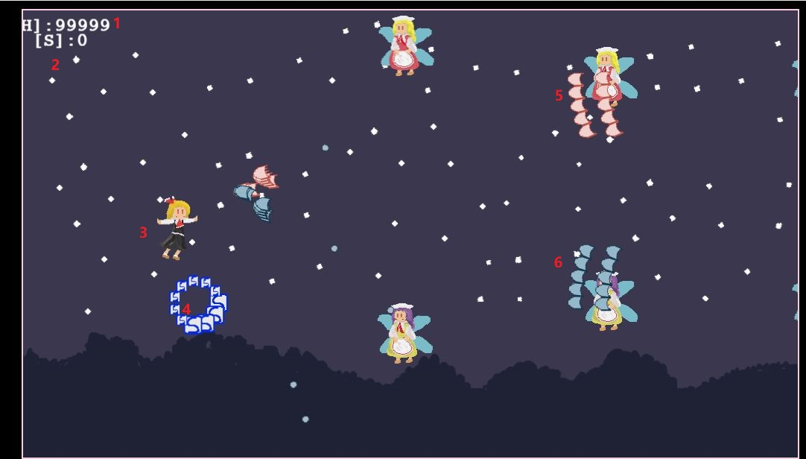
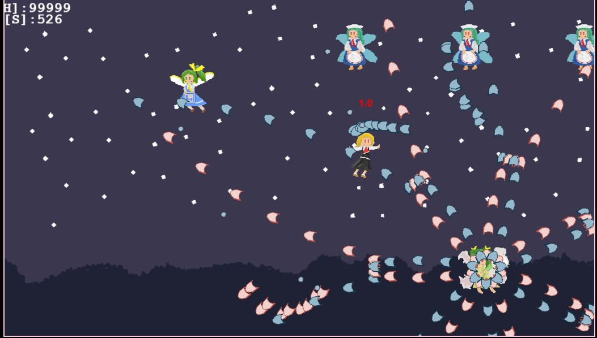
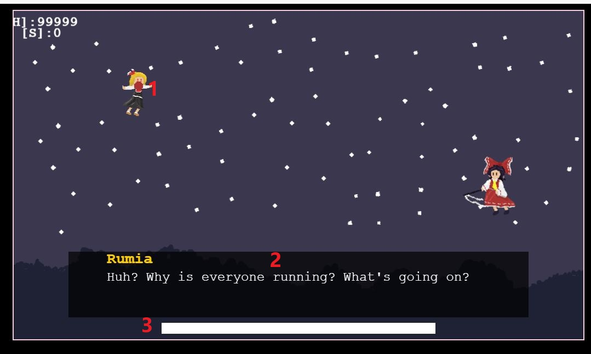

# CMPM120Final
## Overview:
This project is a Touhou-inspired fan game developed using Phaser with JavaScript.
It is a side-scrolling bullet hell game where the player survives waves of enemy attacks by reflecting enemy bullets back at them.
Instead of traditional shooting mechanics, the player’s main attack method is to enter defense mode and reflect specific enemy bullets. Successfully reflecting bullets can defeat enemies and create score items that the player must collect.
The game contains four level, each level have two different boss and different design.
## Control:
W A S D — Move the player
Left Shift — Move slowly for precise dodging
K — Enter Defense Mode
W S: make choose. Space: decide

## Core Mechanics
Defense Mode

When the player enters Defense Mode, they can reflect certain bullets back toward enemies.

Blue Bullets can be reflected.

Red Bullets cannot be reflected.

If the player collides with a red bullet while in Defense Mode, a 4-second cooldown will begin during which the player cannot enter Defense Mode again.

1:Player healthly, When the player's health reaches 0, the game ends.
2:Player score, player current score.
3:Player
4:Score, When an enemy is shot down, a score will appear on the screen. Players need to collect the scores on the screen to score.
5:Red Bullet: player can not reflect this type of bullet
6:Blue Bullet, player can reflect this type of bullet

1:Daiyousei When she appears, you can increase your health by touching her.
2:If you collide with a red bullet in defense mode, there will be a countdown and you cannot enter defense mode before the countdown ends.

1:Player hitPoint, When you press shift will display the hitPoint, The player's health will only decrease when the player's hitpoint collides with the bullet.
2:Dialog box You can press the space key to proceed.
3:Boss Healthly bar

## Project:
Duration Feb 2 2025 ~ March 12 2025
Code: Peilin Huang
Art: Peilin Huang
Audio: Peilin Huang
Design: Peilin Huang
Test: Peilin Huang
